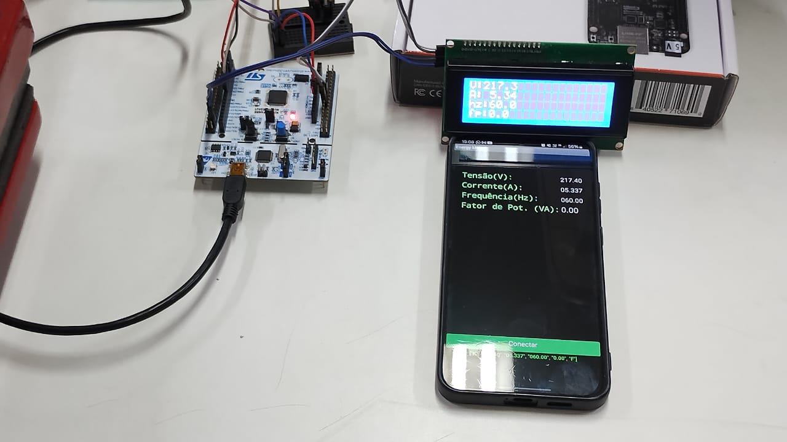
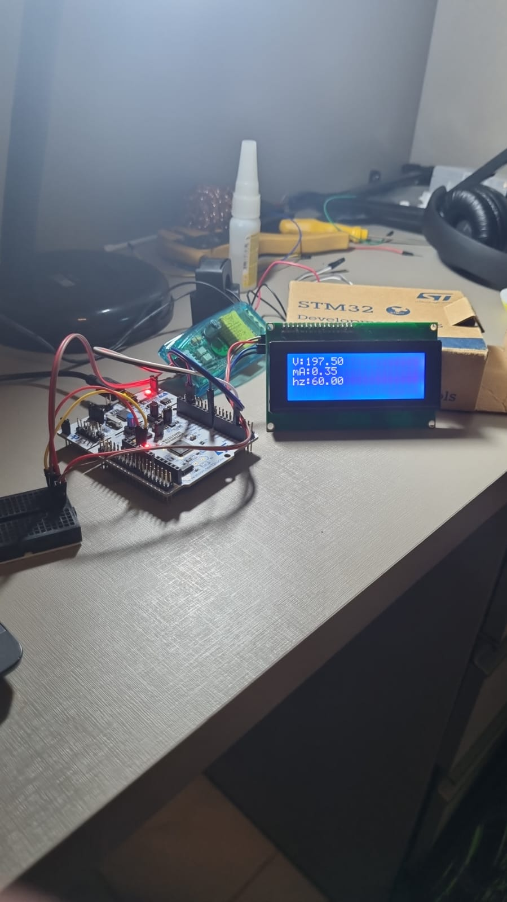

# ENERGY MONITOR

The objective was to implement an energy monitoring system using FreeRTOS to manage multiple real-time tasks. The system measures voltage, current, grid frequency, and power factor, integrating different hardware modules and communication interfaces.

## Technologies and Components
* BOARD - NUCLEO F446RE 
* FreeRTOS – Task management and synchronization using semaphores
* PZEM-004T – Energy measurement module via UART
* I2C LCD Display – Local visualization of measured values
* HC-05 Bluetooth Module – Wireless data transmission
* MIT App Inventor – Android application development

## Task schedule 

## Results 
 

